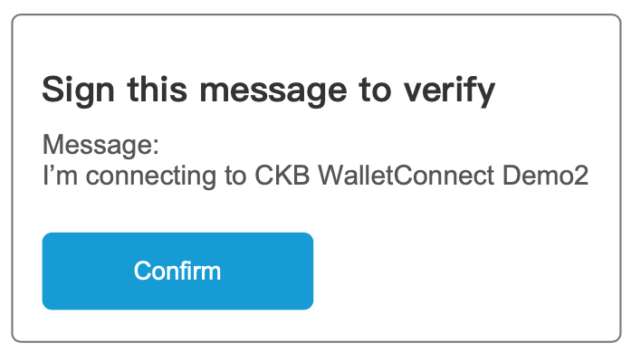

# A process and a dataflow of how Neuron/JoyID work with this protocol
In order to locate and describe the Account issue we may face while using this protocol, A process and dataflow of how Neuron/JoyID work with this protocol is considered a case to talk with.

To solve this problem, a Dapp demo and its UX protocol will be proposed below to demonstrate how the dapp communicates with wallet by this protocol.
# An Dapp demo for showing how wallet connect protocol working.

This is a Dapp demo which designed to demonstrate how this protocol facilitates connections. Users can connect to this Dapp through WalletConnect. Once connected, users can like articles and donate to the author using CKB.

  

# UX protocol & involving field

In this section, the flow and involved field will be demonstrated to show how the protocol work.

## Establish connection

While not log in , users will see the page like this.
  

| Flow | Name | Type | Requirement Levels | Note |
|------|------|------|--------------------|------|
| Connecting flow | WalletConnect Option and WalletConnect QR code | Function | MUST | -- |
| Connecting flow | Notes | Label | SHOULD | Show the user which network is requested to connect and which address sets(dApp request auth) are request in advance |

Involved Namespace in this flow
---
<!-- to do -->
- dapp send
    ```
    {
    ...
        "namespaces": {
        "hathor": {
            "accounts": [ "ckb:mainnet:xxxxx..." ]
            "chains": [ "ckb:mainnet" ],
            "events": [],
            "methods": [
            "ckb_signTransaction"
            ]
        }
        }
    ...
    }
    ```
- Wallet post
    ```

    ```

## HomePage

After logged in, Some account info and dapp functions will be provided to users. 

  
| Page | Name | Type | Requirement Levels | Note |
|------|------|------|--------------------|------|
| HomePage | AcountID | Function | MUST | - |
| HomePage | Network | Label | MUST | Show the user which network is requested to connect and which address sets(dApp request auth) are request in advance |
| HomePage | Disconnet | Function | MUST | The Disconnect function demonstrate how user initial a disconnection on the dapp side. |
| HomePage | Asset | Label | SHOULD | This part info demonstrate how to display info of an Account, like assets of an account in this case. |
| HomePage | Like | Function | SHOULD | The Like function in this case demonstrate how dapp request user to sign message with an Account. |
| HomePage | Donate | Function | SHOULD | The Donate function in this case demonstrate how dapp request user to sign a transaction with an Account. |


### Asset Info

In this dapp, Connected account’s CKB will be shown to user.
First, the dapp **define** the CKB of an account is **the total CKB amount of all addresses in the address set** provided by wallet during connection.


### Like Function
By clicking the Like button, a window will pop up to ask user to confirm ,users are requested to sign a message on his CKB wallet which is connected in the previous connecting part to verify that this account belongs to him.

  

Involved Namespace in this flow
---
<!-- to do -->
- dapp send
    ```

    ```
- Wallet post
    ```

    ```

### Donate Function
By clicking the donation amount, a donation window will pop up to ask user to confirm ,users are requested to sign a transaction on his CKB wallet which is connected in the previous connecting part to send fixed amount CKB to a fixed address.

  

Involved Namespace in this flow
---
<!-- to do -->
- dapp send
    ```

    ```
- Wallet post
    ```

    ```