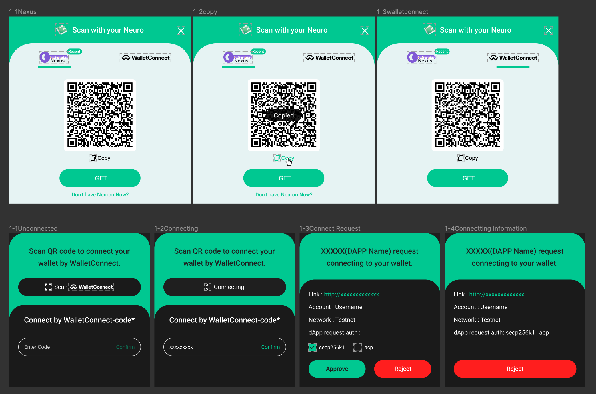
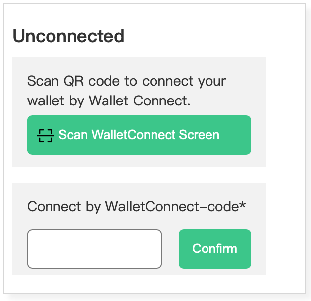
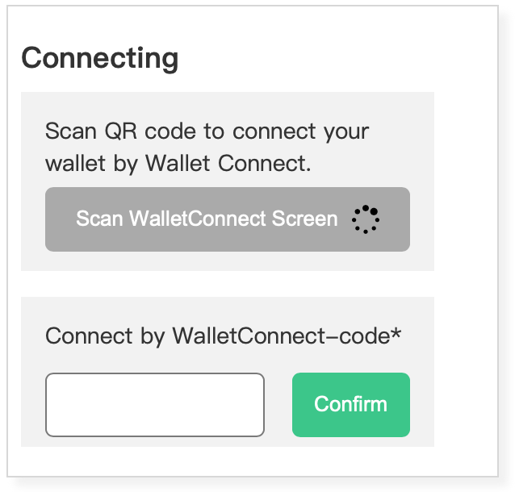

# CKB General Component for WalletConnect

## General Component for Wallet Side

A general component is provided for WalletConnect on the side of third party wallet.

### Related isssues

### Connecting flowchart

> Scanning QR code is the most used and also recommended for users to connect to dApp with your wallet. We also offer a way to connect by pasting the WalletConnect code which could be used for testing. [UI](https://www.figma.com/file/6XNoimRDbFTTNm016rbIdU/Magickbase?type=design&node-id=16072-38648&t=rF3mLzNYeaveGD6Q-0)

#### UI Sketch

#### Status1: Unconnected

While the dapp is unconnected with the wallet, users can click on the button below to scan QR code on the dapp side in order to connect the dapp.

#### Status2: Connecting

After clicking the scan button, and if the QR code is correct then the dapp and wallet are trying to communicate following the protocol. If the QR code is not in correct format, corresponding messages will be popped up.

#### Status3: Connect Request

Once the WalletConnection information fecthes back, the wallet shows the connection request information, including the dapp name, its url, network, Account and Auth.

- The network refers to the CKB network to which the dapp is going to connect.
- The Account refers to the CKB wallet account that the user is going to use.
- The Auth refers to the lock method for user addresses. Typically, a user's addresses can be divided into different adress sets based on the lock method they use, and here various classification methods are provided. Dapps can request the specific address sets they need, and users can choose to revoke authorization for certain address sets.

To cancel this request, just press the Reject button.

#### Status4: Connectting Information

After the connection is established, the dapp will maintain a persistent connection with the wallet. The relevant connection information, the confirmed information from the previous step, will still be displayed here. Users can disconnect from the dapp at any time.

