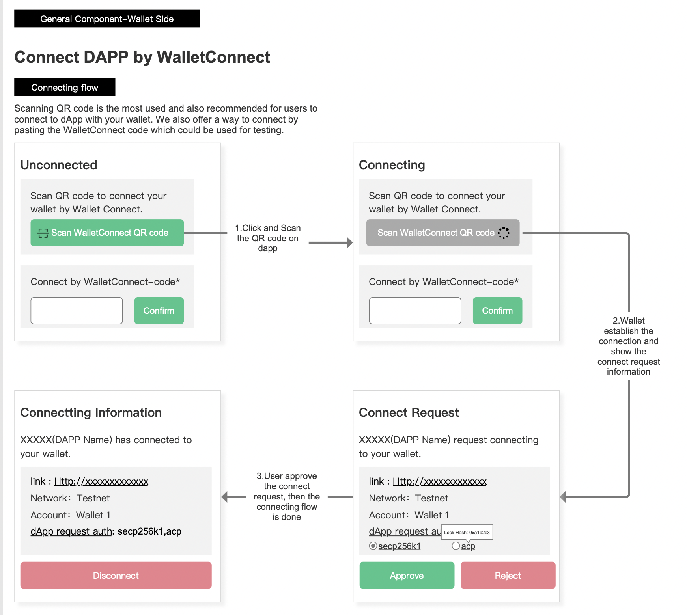
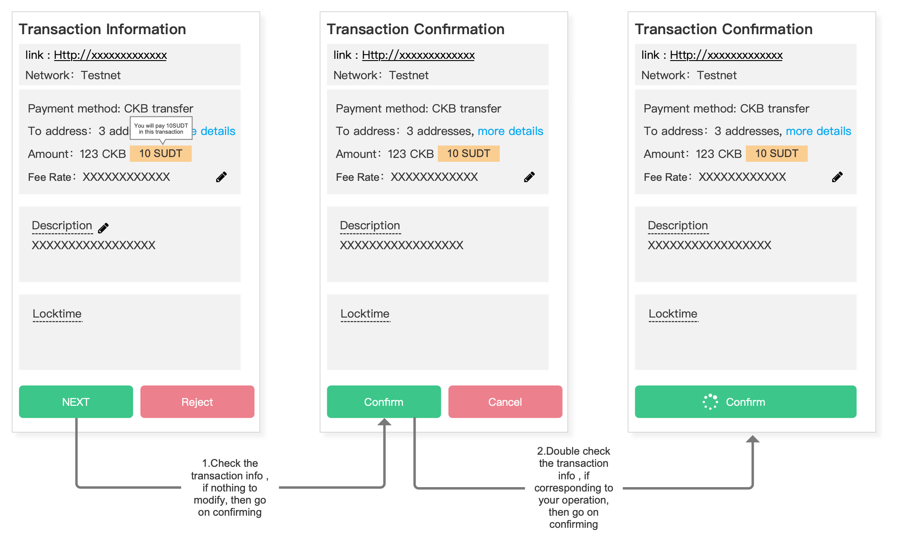
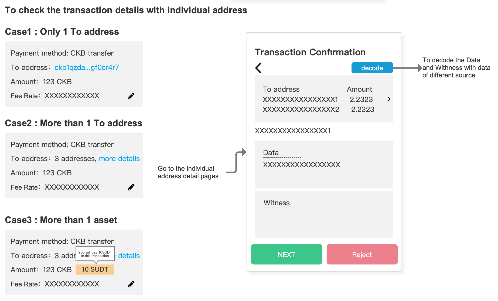
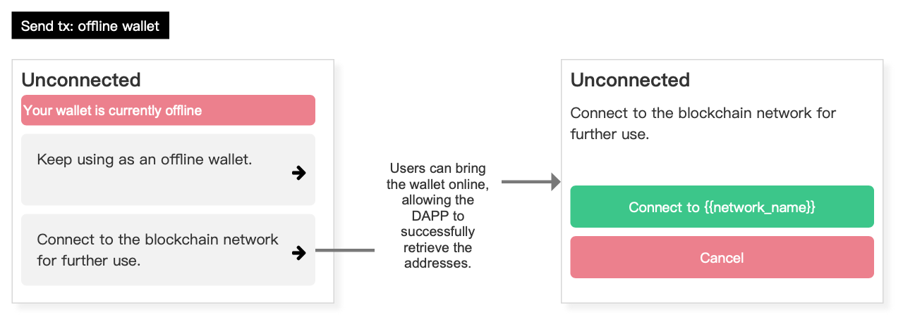

# CKB General Component for WalletConnect

## 1 General Component for Wallet Side

A general component is provided for WalletConnect on the side of third party wallet.

### 1.1 Connecting flowchart

> Scanning QR code is the most used and also recommended for users to connect to dapp with your wallet. We also offer a way to connect by pasting the WalletConnect code which could be used for testing. [UI for Connecting Flowchart](https://www.figma.com/file/6XNoimRDbFTTNm016rbIdU/Magickbase?type=design&node-id=16072-38648&t=rF3mLzNYeaveGD6Q-0)

#### 1.1.1 Corresponding functions and Labels
All the labels and functions which are used to construct the the prototype are listed if you'd like to integrate them into your app in your own way.

|Flow|Name|Type|Requirement Levels|Note|
| -- | -- | -- | -- | -- |
|Connecting flow|Scan WalletConnect QR code|Function|MUST|--|
| Connecting flow | Connect by WalletConnect-code | Function | SHOULD NOT | Supposed to be only used for testing |
| Connecting flow | link | Label | MUST | The URL of the dapp |
| Connecting flow | Network | Label | MUST | The network of current CKB blockchain |
| Connecting flow | Account | Label | MUST | The account user is using on wallet. |
| Connecting flow | Lock Hash | Label | MUST | This means the lock method for user address sets that dapp would like to get access to. [Why this is necessary？](/Neuron-PRDs/WalletConnect/FAQ_en.md)|
| Connecting flow | Disconnect | Function | MUST | -- |

  

#### 1.1.2 Status1: Unconnected

While the dapp is unconnected with the wallet, users can use scan WalletConnect QR code function in order to connect the dapp.

  

#### 1.1.3 Status2: Connecting

To do so, users are always supposed to click a scan button, and if the QR code is correct then the dapp and wallet are trying to communicate following the protocol. If the QR code is not in correct format, corresponding messages will be popped up.

  

#### 1.1.4 Status3: Connect Request

Once the WalletConnection information fecthes back, the wallet shows the connection request information, including the dapp name, its url, network, Account and Auth.

- The network refers to the CKB network to which the dapp is going to connect.
- The Account refers to the CKB wallet account that the user is going to use.
- The Auth refers to the lock method for user addresses. Typically, a user's addresses can be divided into different adress sets based on the lock method they use, and here various classification methods are provided. dapps can request the specific address sets they need, and users can choose to revoke authorization for certain address sets. It is specified that when the method for requesting Lock Hash from Dapp side has no parameters, the Dapp requests all Lock Hashes. When the Dapp provides specific Lock Hashes, it requests the specified Lock Hashes addresses set.

To cancel this request, just press the Reject button.

#### 1.1.5 Status4: Connectting Information

After the connection is established, the dapp will maintain a persistent connection with the wallet. The relevant connection information, the confirmed information from the previous step, will still be displayed here. Users can disconnect from the dapp at any time.

### 1.2 Signing A Message
When a dapp requires the user to perform a signature operation, it can be done through a signature information flow.

|Flow|Name|Type|Requirement Levels|Note|
| -- | -- | -- | -- | -- |
| Signing A Message | link | Label | MUST | The URL of the dapp |
| Signing A Message | Network | Label | MUST | The network that dapp wants the user to sign on |
| Signing A Message | Message | Label | MUST | The message that dapp wants the user to sign with|

Based on the Connected state, the dapp will send a signature request to the wallet. Users can choose to sign or not sign the request on the wallet.

  

Users should be familiar with, understand, and trust the content of their signature before proceeding.

### 1.3 Signing Tx flowchart

#### 1.3.1 Corresponding functions and Labels
|Flow|Name|Type|Requirement Levels|Note|
| -- | -- | -- | -- | -- |
| Send transaction | link | Label | MUST | The URL of the dapp |
| Send transaction | Network | Label | MUST | The network that dapp wants the user to sign on |
| Send transaction | Payment method | Label | SHOULD | Currently, the CKB transactions are all TRANSFER. |
| Send transaction | To Address List | Label | MUST | -- |
| Send transaction | Asset Amounts | Label | MUST | The total Amount of all Assets involved in this transaction|
| Send transaction | Fee or Fee Rate | Label | MUST | -- |
| Send transaction | Description | Label | MUST | -- |
| Send transaction | Locktime | Label | OPTIONAL | -- |
| Send transaction | Recieve Amount for individual address | Label | MUST | This refers to the amounts that every individual address will receive |
| Send transaction | Transaction Info Modify | Function | MUST | Users are able to modify or adjust some data in the transaction like Fee Rate |
| Send transaction | Transaction Data for individual address | Label | MUST | -- |
| Send transaction | Witness for individual address | Label | MUST | -- |
| Send transaction | Decode Data for individual address | Function | SHOULD | The individual data could be decoded for easier reading, however, different sources have been given for users/wallet to choose. |
| Send transaction | Transaction Raw Data  | Label | SHOULD | Transaction Input will be displayed for professional users or any advanced usage. Through the transaction raw data, users can understand the inputs and outputs associated with this transaction.|

When dapp initializes a transaction, this component will pop up/ show.
[UI for Signing Tx flowchart](https://www.figma.com/file/6XNoimRDbFTTNm016rbIdU/Magickbase?type=design&node-id=16536-38593)

#### 1.3.2 To confirm/reject a transaction from dapp

- Normally, if the user want sign the transaction by simply click the NEXT btn then click CONFIRM btn.
  

- To reject or cancel this transaction , you can click REJECT Btn
on the first step.

#### 1.3.3 To modify the transaction information

- Click the modify icon
  

- Then modify information in corresponding text field, and continue.

#### 1.3.4 Further examine the receiving address and its detailed data

- Check more addresses and go to the individual address detail pages. 
  

- To decode the Data and Withness with data of different source.

### 1.4 While wallet is offline

Offline Wallet Case: Considering the current priority of demands, we believe that the case of hot wallets connecting to Dapps is more common. Therefore, the interaction entities in this protocol are "hot wallets" and "Dapps". See more at [FAQ](/Neuron-PRDs/WalletConnect/FAQ_en.md).

While wallet is offline, a pop-up could be triggered to remind user to reconnect or keep offline.

|Flow|Name|Type|Requirement Levels|Note|
| -- | -- | -- | -- | -- |
| Offline usage | link | Label | MUST | The URL of the dapp |
| Offline usage | Network Name | Label | MUST | The network that dapp wants the user to sign on |

 
